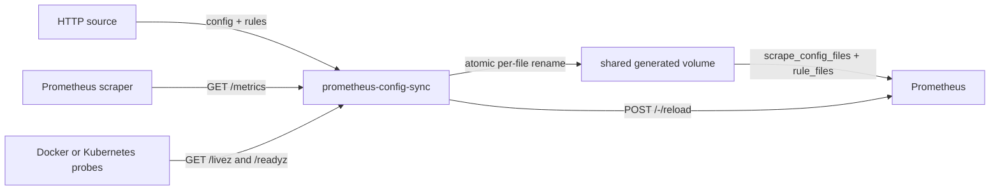

# Architecture

[Українська](ARCHITECTURE.uk.md)

## Components

`prometheus-config-sync` is a single-process control-loop service between an HTTP source API, a shared generated-file volume, and the Prometheus lifecycle endpoint.

## Synchronization flow

Each cycle obtains a stable HTTP source snapshot before doing any filesystem work. One snapshot consists of independent reads from `/prometheus/config` and `/prometheus/rules` with per-response size limits. The service reads the complete snapshot twice and accepts it only when both versions are byte-identical. If they differ, it retries this stabilization sequence up to three times with a short delay. A continuously changing HTTP source snapshot fails the cycle without validation, publication, or reload.

After stabilization, the service computes a generation digest and compares it with both the current files and the persisted applied-generation marker. A new or pending generation is validated in a temporary directory before publication. Changed files are published through temporary files and rename with rollback of the first file if the second publication fails. Prometheus reload is then requested; only a successful reload persists the applied-generation marker and makes readiness positive. A failed reload remains pending and is retried even when HTTP source returns identical bytes. If reload succeeds but marker persistence fails, the running process remembers the reloaded digest and retries only marker persistence; after a process restart one conservative reload may occur.

Each stabilization sample still consists of two independent HTTP reads, and publication still uses two independent file renames. Comparing two consecutive samples rejects observed cross-response changes but cannot provide the atomicity of a revisioned HTTP source bundle. Rollback prevents a failed publication from leaving a mixed generation, and config-sync never reloads Prometheus between the renames, but the two paths are not a filesystem-level snapshot transaction. Deploy exactly one writer, avoid external reloads during publication, and use a revisioned/bundled HTTP source contract when strict cross-response consistency is required.

## Deployment ownership

| Resource                          | Owner                               | Contract                                                |
|-----------------------------------|-------------------------------------|---------------------------------------------------------|
| HTTP source API                   | any compatible web server           | Returns complete config and rule YAML with HTTP 200     |
| Generated directory               | config-sync writer                  | Writable by UID 10001; only one writer                  |
| Generated files                   | config-sync writer                  | Readable by Prometheus                                  |
| Prometheus base configuration     | Prometheus operator/deployment      | References generated paths and enables lifecycle reload |
| Reload endpoint                   | Prometheus                          | Reachable from config-sync                              |
| Metrics Service/ServiceMonitor    | config-sync Helm chart              | Exposes the configured metrics path                     |
| Shared PVC mounting in Prometheus | Prometheus deployment configuration | Uses the same claim as config-sync, normally read-only  |

## Health semantics

The process starts unready. `/livez` returns 200 whenever the HTTP process is serving and does not depend on HTTP source or Prometheus. A fetch, snapshot, state-read, validation, publication, marker, or reload failure makes `/readyz` and its compatibility alias `/healthz` return 503 and sets `prometheus_config_sync_healthy` to `0`. Readiness becomes 200 and the gauge becomes `1` only after the desired generation is known to match the files and its digest has been persisted following a successful reload. `/metrics` availability and Prometheus `up` alone only prove that the web listener is scrapeable.

## Current failure boundaries

- Every HTTP source and reload request uses the configured `HTTPTimeout`; successful HTTP source bodies also have per-asset size limits. A stable cycle normally performs four HTTP source requests and an unstable cycle may perform up to twelve.
- Validation uses `promtool` with a separate timeout when a path is configured. The packaged image configures it by default.
- Web TLS and authentication are delegated to Prometheus exporter-toolkit.
- A fatal startup or listener failure is returned from `Run` so the process supervisor can restart the daemon.
- Shutdown cancels and waits up to five seconds for an in-flight initial synchronization before returning; a wait timeout is surfaced as an error instead of silently abandoning the operation.
- The Helm chart enforces one replica because the application has no distributed writer lease.
- A PVC created by this chart is not automatically mounted into Prometheus; that is an external deployment responsibility.

The remaining architectural limitation is strict snapshot consistency across the two independent HTTP source responses and two fixed output paths. Solving that completely requires a versioned bundle contract and/or a generation-directory pointer consumed by Prometheus.
