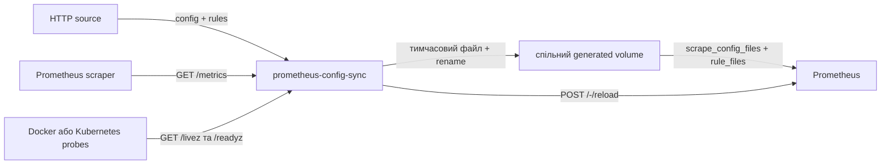

# Архітектура

[English](ARCHITECTURE.md)

`prometheus-config-sync` — це однопроцесний control loop між HTTP source API, спільним volume зі згенерованими файлами та lifecycle endpoint Prometheus.

Кожен цикл спочатку отримує стабільний HTTP source snapshot. Один snapshot складається з незалежних запитів до `/prometheus/config` і `/prometheus/rules` з окремими size limits. Сервіс двічі читає повний snapshot і приймає його лише тоді, коли обидві версії байт-у-байт однакові. Якщо вони відрізняються, послідовність повторюється до трьох разів із короткою затримкою. HTTP source, що безперервно змінюється, завершує цикл помилкою без validation, publication і reload.

Після стабілізації сервіс обчислює digest generation та порівнює його з файлами й persisted marker. Нова або pending generation спочатку проходить `promtool` у staging directory. Лише після цього файли публікуються, викликається reload, а успішний digest записується в `.prometheus-config-sync-applied.sha256`. Невдалий reload залишається pending і повторюється навіть для ідентичних HTTP source bytes. Якщо reload успішний, але marker не записався, поточний процес пам'ятає reloaded digest і повторює лише marker persistence; після restart можливий один conservative reload.

Один output directory повинен мати рівно одного writer. Кожен stabilization sample усе ще складається з двох окремих HTTP-запитів, а publication — із двох окремих rename. Порівняння двох послідовних samples відкидає помічені міжфайлові зміни, але не замінює атомарний versioned bundle contract HTTP source. Стабільний цикл виконує чотири HTTP source requests, нестабільний — до дванадцяти.

## Власність стану

| Ресурс                         | Власник                       | Контракт                                |
|--------------------------------|-------------------------------|-----------------------------------------|
| HTTP source API                | будь-який сумісний web server | Повні YAML-відповіді з HTTP 200         |
| Generated directory            | config-sync                   | Один writer, UID 10001 має право запису |
| Base config і lifecycle        | Prometheus deployment         | Generated paths та увімкнений reload    |
| PVC mount у Prometheus         | Оператор Prometheus           | Той самий claim, зазвичай read-only     |
| Metrics Service/ServiceMonitor | Helm chart                    | Доступ до configured metrics path       |

Після старту сервіс unready. `/livez` повертає 200, поки HTTP-процес обслуговує запити, і не залежить від HTTP source або Prometheus. Fetch, snapshot, state-read, validation, publication, marker або reload failure повертає `/readyz` та compatibility alias `/healthz` у 503 і встановлює `prometheus_config_sync_healthy` у `0`. Readiness стає 200, а gauge — `1` лише для generation, яка збігається з файлами та має persisted marker після успішного reload. Метрика `up` перевіряє лише доступність scrape endpoint.

Helm chart забороняє кілька replicas, оскільки distributed writer lease відсутній. Створений chart-ом PVC не монтується у Prometheus автоматично — це зовнішня частина deployment contract.

## Межі відмов

- Кожен HTTP source і reload request використовує configured `HTTPTimeout`; успішні HTTP source bodies мають окремі size limits.
- Validation використовує окремий timeout і запускає `promtool`, якщо його path налаштовано. Packaged image налаштовує його за замовчуванням.
- Web TLS та authentication делеговано Prometheus exporter-toolkit.
- Fatal startup або listener failure повертається з `Run`, щоб supervisor міг перезапустити daemon.
- Shutdown скасовує initial synchronization і чекає її завершення до п'яти секунд перед поверненням; timeout очікування повертається як помилка замість тихого abandon операції.
- Helm chart вимагає одну replica, оскільки application не має distributed writer lease.
- PVC, створений chart-ом, не монтується у Prometheus автоматично.

Архітектурне обмеження, що залишилося, — відсутність строгої атомарності між двома незалежними HTTP source responses і двома фіксованими output paths. Повне вирішення потребує versioned bundle contract та/або generation-directory pointer, який споживає Prometheus.
